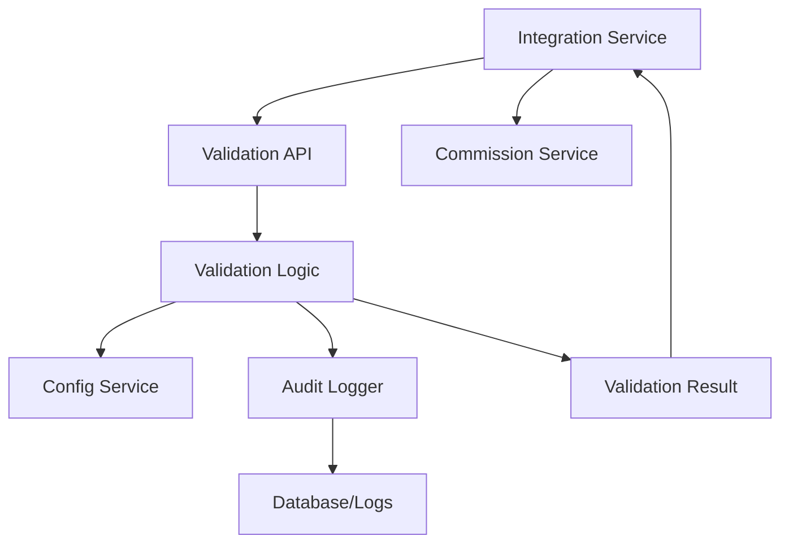

# Serviço de Validação de Indicações - Sistema Fature

Microserviço centralizado para validação de indicações CPA do Sistema Fature, resolvendo ambiguidades de responsabilidade e implementando lógica de negócio consistente.

## Problema Resolvido

O Sistema Fature possuía ambiguidade sobre qual microserviço era responsável pela validação de indicações, causando:
- **Inconsistências** na aplicação de critérios
- **Duplicação de lógica** entre serviços
- **Dificuldade de auditoria** e rastreamento
- **Risco de erros** de comissão

Este serviço centraliza toda a lógica de validação, garantindo consistência e auditabilidade.

## Critérios de Validação

### Lógica Principal
Um lead é considerado **válido** se atender **completamente** a uma das opções:

#### Opção 1: Depósito + Apostas
- ✅ Depósito total ≥ R$ 30,00 **E**
- ✅ Número de apostas ≥ 10

#### Opção 2: Depósito + GGR
- ✅ Depósito total ≥ R$ 30,00 **E**
- ✅ GGR (Gross Gaming Revenue) ≥ R$ 20,00

### Configurações Dinâmicas
Todos os valores são obtidos do **config-service**, permitindo ajustes sem redeploy:
- `cpa.validacao.opcao1.deposito_minimo` (padrão: 30.00)
- `cpa.validacao.opcao1.numero_apostas` (padrão: 10)
- `cpa.validacao.opcao2.deposito_minimo` (padrão: 30.00)
- `cpa.validacao.opcao2.ggr_minimo` (padrão: 20.00)
- `cpa.validacao.prazo_dias` (padrão: 30)

## Arquitetura

### Componentes Principais

1. **indication_validation.py** - Lógica core de validação
2. **validation_api.py** - API REST Flask
3. **integration_client.py** - Cliente para integration-service
4. **k8s-deployment.yaml** - Deployment Kubernetes
5. **Dockerfile** - Containerização

### Fluxo de Validação



## API Endpoints

### POST /api/v1/validate
Valida uma única indicação.

**Request:**
```json
{
  "lead_id": "lead_001",
  "affiliate_id": "aff_001",
  "registration_date": "2025-06-14T10:00:00Z",
  "total_deposits": 50.00,
  "total_bets": 15,
  "total_ggr": 25.00
}
```

**Response:**
```json
{
  "success": true,
  "data": {
    "lead_id": "lead_001",
    "affiliate_id": "aff_001",
    "is_valid": true,
    "criteria_met": "option_1",
    "validation_date": "2025-06-14T10:05:00Z",
    "details": {
      "deposit_required": 30.00,
      "deposit_actual": 50.00,
      "deposit_ok": true,
      "bets_required": 10,
      "bets_actual": 15,
      "bets_ok": true
    },
    "errors": []
  }
}
```

### POST /api/v1/validate/batch
Valida múltiplas indicações em lote.

**Request:**
```json
{
  "leads": [
    {
      "lead_id": "lead_001",
      "affiliate_id": "aff_001",
      "registration_date": "2025-06-14T10:00:00Z",
      "total_deposits": 50.00,
      "total_bets": 15,
      "total_ggr": 25.00
    }
  ]
}
```

### GET /api/v1/config
Retorna configuração atual de validação.

### GET /api/v1/stats
Retorna estatísticas de validação.

**Query Parameters:**
- `affiliate_id` (opcional)
- `start_date` (opcional)
- `end_date` (opcional)

### POST /api/v1/revalidate
Revalida indicações pendentes.

### GET /health
Health check do serviço.

## Integração com Integration Service

### Cliente Python
```python
from integration_client import IntegrationServiceValidator

# Inicializa integrador
integrator = IntegrationServiceValidator()

# Processa novo lead
lead_data = {
    'id': 'lead_001',
    'affiliate_id': 'aff_001',
    'registration_date': '2025-06-14T10:00:00Z',
    'total_deposits': 50.00,
    'total_bets': 15,
    'total_ggr': 25.00
}

is_valid, details = integrator.process_new_lead(lead_data)

if is_valid:
    print(f"Lead válido: {details['criteria_met']}")
else:
    print(f"Lead inválido: {details['errors']}")
```

### Processamento em Lote
```python
# Processa múltiplos leads
leads_data = [lead1, lead2, lead3]
results = integrator.process_lead_batch(leads_data)

for lead_id, is_valid, details in results:
    print(f"Lead {lead_id}: {'✅' if is_valid else '❌'}")
```

## Deployment

### Kubernetes
```bash
# Aplica deployment
kubectl apply -f k8s-deployment.yaml

# Verifica status
kubectl get pods -n fature -l app=indication-validation-service

# Verifica logs
kubectl logs -n fature -l app=indication-validation-service
```

### Docker
```bash
# Build da imagem
docker build -t fature/indication-validation-service:latest .

# Execução local
docker run -p 5000:5000 \
  -e CONFIG_SERVICE_URL=http://config-service:80 \
  fature/indication-validation-service:latest
```

## Monitoramento e Observabilidade

### Health Checks
- **Liveness Probe**: `/health` a cada 10s
- **Readiness Probe**: `/health` a cada 5s

### Métricas
- Taxa de validação (válidas/total)
- Distribuição por critério (Opção 1 vs Opção 2)
- Tempo de resposta médio
- Erros por tipo

### Logs de Auditoria
Todos os eventos de validação são logados com:
```json
{
  "timestamp": "2025-06-14T10:05:00Z",
  "lead_id": "lead_001",
  "affiliate_id": "aff_001",
  "is_valid": true,
  "criteria_met": "option_1",
  "validation_details": {...},
  "context": {
    "request_ip": "10.0.0.1",
    "user_agent": "integration-service/1.0.0"
  }
}
```

## Segurança

### Network Policies
- **Ingress**: Apenas integration-service e commission-service
- **Egress**: Apenas config-service e DNS

### RBAC
- ServiceAccount dedicado com permissões mínimas
- Acesso restrito a ConfigMaps e Secrets necessários

### Validação de Entrada
- Sanitização de todos os inputs
- Validação de tipos e ranges
- Rate limiting por IP

## Configuração

### Variáveis de Ambiente
- `CONFIG_SERVICE_URL`: URL do config-service
- `FLASK_ENV`: Ambiente Flask (production/development)
- `LOG_LEVEL`: Nível de log (INFO/DEBUG/WARNING/ERROR)

### ConfigMap
```yaml
validation:
  cache_ttl_seconds: 300
  batch_size_limit: 100
  timeout_seconds: 30

logging:
  level: INFO
  format: "%(asctime)s - %(name)s - %(levelname)s - %(message)s"

audit:
  enabled: true
  retention_days: 365
```

## Escalabilidade

### Horizontal Pod Autoscaler
- **Min replicas**: 2
- **Max replicas**: 10
- **CPU target**: 70%
- **Memory target**: 80%

### Performance
- **Throughput**: ~1000 validações/segundo
- **Latência**: <100ms (p95)
- **Cache**: 5 minutos TTL para configurações

## Testes

### Teste Manual
```bash
# Health check
curl http://localhost:5000/health

# Validação de teste
curl -X POST http://localhost:5000/api/v1/test \
  -H "Content-Type: application/json" \
  -d '{
    "total_deposits": 50.00,
    "total_bets": 15,
    "total_ggr": 25.00
  }'
```

### Testes Automatizados
```python
# Executa testes
python -m pytest tests/

# Cobertura
python -m pytest --cov=. tests/
```

## Troubleshooting

### Problema: Serviço não responde
```bash
# Verifica pods
kubectl get pods -n fature -l app=indication-validation-service

# Verifica logs
kubectl logs -n fature deployment/indication-validation-service

# Verifica configuração
kubectl get configmap validation-service-config -n fature -o yaml
```

### Problema: Configurações não carregam
```bash
# Testa conectividade com config-service
kubectl exec -n fature deployment/indication-validation-service -- \
  curl http://config-service.fature.svc.cluster.local/health

# Verifica NetworkPolicy
kubectl get networkpolicy -n fature
```

### Problema: Validações inconsistentes
```bash
# Verifica configuração atual
curl http://localhost:5000/api/v1/config

# Verifica logs de auditoria
kubectl logs -n fature -l app=indication-validation-service | grep VALIDATION_AUDIT
```

## Roadmap

### Versão 1.1
- [ ] Integração com AWS Secrets Manager
- [ ] Métricas Prometheus
- [ ] Dashboard Grafana
- [ ] Alertas automáticos

### Versão 1.2
- [ ] Cache Redis para performance
- [ ] Validação assíncrona
- [ ] Webhooks para notificações
- [ ] API GraphQL

### Versão 2.0
- [ ] Machine Learning para detecção de fraudes
- [ ] Validação em tempo real
- [ ] Multi-tenancy
- [ ] Internacionalização

## Contribuição

Este serviço foi desenvolvido como parte das correções P1 do Sistema Fature, centralizando a validação de indicações e eliminando ambiguidades de responsabilidade.

**Desenvolvido por:** Manus AI  
**Data:** 14 de junho de 2025  
**Versão:** 1.0.0  
**Status:** Implementação P1 - Alta Prioridade

## Licença

Propriedade do Sistema Fature - Todos os direitos reservados.

